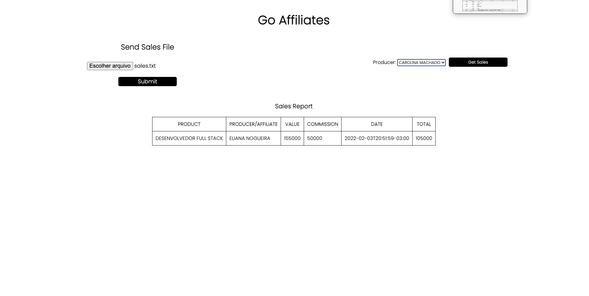

# GO Affiliates Project #

Go Affiliates to manager content producers and affiliates sales.

## Conteúdos

- [General View](#general-view)
    - [The challenge](#the-chalenge)
- [The development](#the-development-process)
    - [Tools used](#tools-used)
    - [Lessons learned](#lessons-learned)
- [Usage](#usage)
- [Author](#author)

## General View

This project is to manager content producers and affiliates sales.

### The Challennge

Send a file with the sales of the content producers and affiliates, normalize the data and store it in a
relational database. In this case is PostgreSQL.

## Image

<div align="center">
  
</div>

### To access the API documentation click [here](https://github.com/beto-ouverney/go-affiliates/tree/desafio/backend)

## Author

- LinkedIn - [Alberto Ouverney Paz](https://www.linkedin.com/in/beto-ouverney-paz/)

## The user will be able to:

Send a file with the sales of the content producers and affiliates, normalize the data and store it in a
relational database. In this case is PostgreSQL.

## Development process:

## The development process

In the product and affiliates table I chose to put only their names and the producer id, because those are the only ones,
together with date, that are immutable over time, as there could be an equal product from the same producer,
but with different values, the same goes for the affiliate. An affiliate could have different comissions over time,
if the file sent were the entire existing database, there would be the possibility of changing the values of comissions
and the value of the product.


## In portuguese:

Optei colocar nas tabelas product e affiliates somente os nomes dos mesmos e o id do producer porque são
os únicos juntos com o date que sao imutaveis ao longo do tempo, pois poderia ter um mesmo produto de um producer com
diferente values, o mesmo vale para o affiliate. Um affiliate poderia ter uma comissoes diferentes
ao longo do tempo caso o arquivo enviado fosse toda a base de dados existente grande seria a possibilidade de
ter alteração de valores de comissão e o valor do produto.


### Backend

[Golang](https://golang.org/)
- [PostgreSQL](https://www.postgresql.org/)
- [Swagger](https://swagger.io/)
- [Gin Gonic](https://github.com/gin-gonic/gin)
- [Docker](https://www.docker.com/)

### Frontend

- [Vue.js](https://vuejs.org/)
- [Typescript](https://www.typescriptlang.org/)
- [Sass](https://sass-lang.com/)

## Usage

- Clone repository
```bash
  git@github.com:beto-ouverney/go-affiliates.git
```

- Use the command below to up the Project containers in test mode
```bash
make docker-test-up
```
- there are two databases, one for continuous use and one for testing only,
  so that there is no conflict between test data and continuous usage data.
  By default it comes set to the test bench, to change it 
  you must rename the .env to .env.test and rename the .env.dev to .env

- Use the command below to up the Project containers in development mode:
```bash
make docker-up
```
- To eliminate test containers use the command below:

```bash
make docker-test-down
```

- To eliminate development containers use the command below:

```bash
make docker-down
```

- After the containers are up, you need access the backend container and run the server:

```bash

- To access the test backend container use the command below:

```bash
make back-container-test
```

To access the Development backend container use the command below:

```bash
make back-container
```

- Para rodar o backend
-
```bash
make run
```

Then you need to run front end, in the root of the project run the command below:

```bash
make run-front
```
Then you can access the project in the browser at the address:

http://localhost:8080/

## Test

* The test database must be active and the test environment variables as well, otherwise it will not run all tests, only mocked ones.
  - In handler tests, the database is populated at the beginning of each test and then dropped.

- To be able to run all tests, the backend container must be accessed
```bash
make back-container-test
```

- To run the tests use the command below inside the backend container:

```bash
make test
```

- To See the swagger documentation:
* use endpoint /api/v1/swagger/index.html

- To see all commands:

```bash
make help
```

## Author

- LinkedIn - [Alberto Ouverney Paz](https://www.linkedin.com/in/beto-ouverney-paz/)
